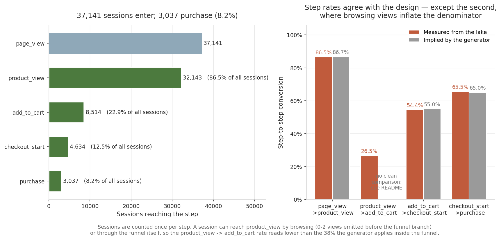
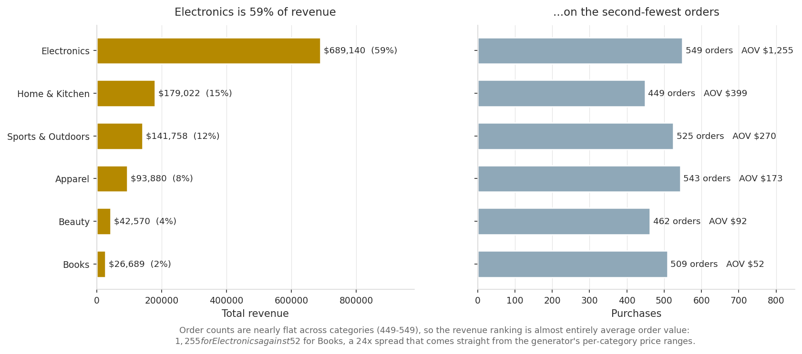
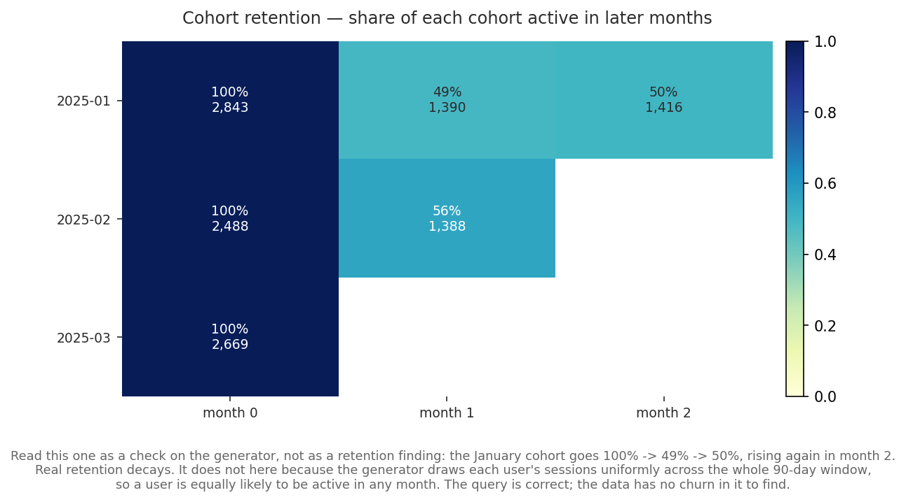
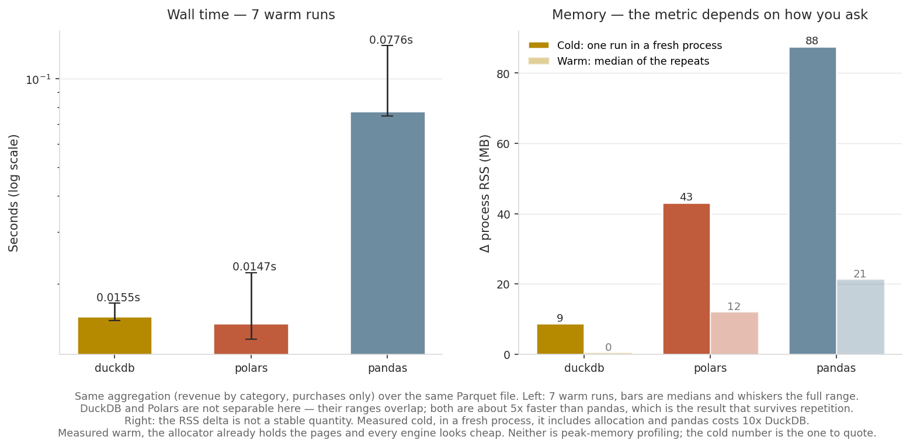

[ 🇺🇸 [Read in English](README.md) ] | [ 🇨🇱 Español ]

# Modern Lakehouse Analytics Pipeline


Pipeline de datos moderno para ingesta y analítica de clickstream/e-commerce a escala, construido sobre un **lakehouse** de archivos Parquet particionados: Polars para ETL multihilo, PyArrow para el particionamiento columnar, y DuckDB como motor SQL analítico embebido que consulta el lake directamente sin cargarlo completo a RAM.

## Caso de uso de negocio

Un sitio de e-commerce genera eventos de clickstream (vistas de página, vistas de producto, carritos, checkouts, compras) a un volumen que ya no cabe cómodamente en un `pandas.DataFrame` en memoria. Este proyecto simula ese escenario end-to-end:

1. **Genera** 100,000+ eventos sintéticos con un embudo de conversión realista.
2. **Ingiere** esos eventos: limpia, valida el contrato de esquema, y los persiste como un Data Lake Parquet particionado por fecha.
3. **Analiza** el lake con SQL directo sobre Parquet (DuckDB) para responder preguntas de negocio: ¿dónde se cae la gente en el embudo? ¿qué cohortes retienen mejor? ¿quiénes son los clientes de mayor valor?
4. **Compara** el enfoque contra un pipeline Pandas tradicional, midiendo tiempo y memoria.

## Arquitectura

```
┌───────────────────────────┐
│ synthetic_clickstream.py  │   genera eventos (page_view -> ... -> purchase)
└─────────────┬──────────────┘
              │
              ▼
   data/raw/clickstream_events.parquet   (sin particionar, ~100k+ filas)
              │
              ▼
┌───────────────────────────┐
│      ingestion.py          │   Polars: dedup, sanidad numérica, columnas de partición
│  (contrato Pydantic v2)    │   PyArrow: escritura particionada Hive-style
└─────────────┬──────────────┘
              │
              ▼
   data/lakehouse/events/
   ├── year=2025/month=01/day=01/part-0.parquet
   ├── year=2025/month=01/day=02/part-0.parquet
   └── ...                                  (1 archivo Parquet por día)
              │
              ▼
┌───────────────────────────┐
│       analytics.py         │   DuckDB: SQL directo sobre Parquet, sin cargar todo a RAM
└─────────────┬──────────────┘
              │
   ┌──────────┼───────────┬───────────────┐
   ▼          ▼            ▼               ▼
 Embudo   Cohortes/     LTV top          Ingresos
 conv.    retención     clientes         por categoría
```

## Estructura del proyecto

```
ecommerce-lakehouse-duckdb/
├── data/
│   ├── raw/                          # clickstream_events.parquet (generado, no versionado)
│   └── lakehouse/                    # events/year=/month=/day=/*.parquet (generado, no versionado)
├── src/
│   ├── generators/
│   │   └── synthetic_clickstream.py  # Genera 100,000+ eventos de clickstream sintéticos
│   ├── lakehouse/
│   │   ├── ingestion.py              # Polars + PyArrow: limpieza, contrato de esquema, particionado
│   │   └── analytics.py              # DuckDB: embudo, cohortes, LTV, ingresos por categoría
│   ├── benchmark.py                  # Pandas vs. Polars vs. DuckDB: tiempo y RAM
│   └── make_figures.py               # Gráficos del README, desde las mismas consultas
├── tests/
│   └── test_lakehouse.py             # Pruebas de esquema y métricas (pytest)
├── .github/workflows/tests.yml       # CI: corre pytest en cada push/PR
├── requirements.txt
└── README.md
```

## Dataset sintético

`src/generators/synthetic_clickstream.py` simula 8,000 usuarios repartidos en tres segmentos de compromiso (`one_time`, `casual`, `loyal`, con distinto número de sesiones cada uno) a lo largo de ~90 días. Cada sesión progresa por un embudo con caída de conversión realista en cada paso:

```
page_view -> product_view -> add_to_cart -> checkout_start -> purchase
  100%          ~60%             ~38%            ~55%            ~65%
                                                            (condicional al paso anterior)
```

Con la semilla por defecto esto produce **~112,000 eventos** (por encima del mínimo de 100,000 pedido), con columnas: `event_id`, `user_id`, `session_id`, `event_type`, `event_timestamp`, `product_id`, `category`, `price`, `quantity`, `revenue`, `device_type`, `country`, `referrer_source`.

## Módulos

### `src/lakehouse/ingestion.py`
- **Limpieza (Polars)**: deduplica por `event_id`, descarta filas sin `user_id`/`event_timestamp`, anula (no inventa) `price`/`quantity`/`revenue` negativos.
- **Contrato de esquema (Pydantic v2)**: `ClickstreamEventContract` valida que las columnas requeridas existan, y valida por tipo una muestra de filas (no todas — a este volumen, validar fila por fila contradice el propósito de un pipeline de alto rendimiento). Una violación de contrato lanza una excepción: indica un bug de ingestión, no un dato de negocio inválido a aislar.
- **Particionado (PyArrow)**: escribe el resultado como Parquet Hive-partitioned (`year=/month=/day=`), con `existing_data_behavior="delete_matching"` para que reprocesar sea idempotente.

### `src/lakehouse/analytics.py`
Cuatro consultas de negocio, todas SQL puro ejecutado por DuckDB directamente sobre los archivos Parquet (`read_parquet(..., hive_partitioning=true)`):
- `conversion_funnel` — sesiones que alcanzan cada paso del embudo.
- `cohort_retention` — usuarios activos por mes, agrupados por el mes de su primer evento.
- `customer_ltv` — top clientes por ingresos totales de compra.
- `revenue_by_category` — ingresos y ticket promedio por categoría.



#### El embudo mide algo levemente distinto de lo que configura el generador

Entran 37.141 sesiones y compran 3.037, una tasa punta a punta de 8,2%. Tres de las cuatro tasas por paso caen sobre los parámetros del generador: 86,5% contra 86,7% implícito, 54,4% contra 55%, 65,5% contra 65%. La segunda no — lee **26,5% donde el generador aplica 38%**.

No es un bug ni de la consulta ni del generador. `_simulate_session` emite 0–2 `product_view` de navegación *antes* de la rama del embudo, independientes de la probabilidad del funnel:

```python
emit("page_view")
for _ in range(rng.randint(0, 2)):        # navegación, fuera del embudo
    emit("product_view", product=rng.choice(catalog))
if rng.random() < 0.60:                   # el product_view propio del embudo
    emit("product_view", product=product)
    if rng.random() < 0.38:
        emit("add_to_cart", product=product)
```

Entonces una sesión alcanza `product_view` por navegación o por el embudo: P = 1 − (1/3)(1 − 0,60) = **86,7%**, que es lo que mide el primer paso. Pero `add_to_cart` solo es alcanzable por la rama del embudo: P = 0,60 × 0,38 = **22,8% de todas las sesiones**, y el lake da 8.514/37.141 = 22,9%. Los dos números están exactamente bien. La tasa de 26,5% es baja porque su *denominador* incluye sesiones que solo navegaron y nunca estuvieron en el embudo.

Ese es el modo de falla corriente del análisis de embudos sobre clickstream real: un tipo de evento que se dispara dentro y fuera del embudo corrompe la tasa del paso que lo usa de denominador, mientras deja todos los conteos absolutos correctos. La corrección es definir el embudo sobre sesiones con intención de compra en vez de sobre todas — algo que los eventos crudos permiten, y que esta consulta deliberadamente no hace, para que la distinción quede visible.



Los ingresos están concentrados: Electronics es 58,7% del total con 549 compras, el segundo conteo de órdenes más bajo. Las compras son casi planas entre las seis categorías (449–549), así que el ranking de ingresos es casi enteramente ticket promedio — $1.255 de Electronics contra $52 de Books, una brecha de 24x que viene directo de los rangos de precio por categoría del generador.



La consulta de cohortes funciona y las tres cohortes suman exactamente los 8.000 usuarios generados. El *resultado*, en cambio, es un chequeo sobre los datos más que un hallazgo: la cohorte de enero va 100% → 49% → 50%, subiendo en el mes 2. La retención real decae. Acá no, porque el generador sortea las sesiones de cada usuario de forma uniforme sobre toda la ventana de 90 días, así que un usuario tiene la misma probabilidad de estar activo en cualquier mes. No hay churn en estos datos que encontrar, y lo honesto es decirlo en vez de presentar una curva plana como un insight de retención.

### `src/benchmark.py`
Corre la misma agregación (ingresos por categoría, solo compras) con Pandas, Polars y DuckDB sobre el mismo archivo Parquet, y mide tiempo (`time.perf_counter`) y delta de memoria RSS del proceso (`psutil`).

## Resultados del benchmark

Corrida real sobre 112.608 eventos:



| Motor | Frío: tiempo (s) | Frío: Δ RSS (MB) | Tibio: mediana tiempo (s) | Tibio: mediana Δ RSS (MB) |
|-------|-----------------:|-----------------:|--------------------------:|--------------------------:|
| DuckDB |           0,0182 |              8,7 |                    0,0155 |                       0,4 |
| Polars |           0,0212 |             43,1 |                    0,0147 |                      12,0 |
| Pandas |           0,1116 |             87,6 |                    0,0776 |                      21,3 |

**El resultado que sobrevive a la repetición es que tanto DuckDB como Polars son ~5x más rápidos que pandas.** La diferencia entre DuckDB y Polars no es algo que este benchmark pueda dirimir: medida en frío, DuckDB va adelante en ambas dimensiones; medida en tibio sobre 7 corridas, Polars tiene la mediana más baja y los dos rangos se solapan. Sobre una sola agregación de 112k filas los dos son la misma clase de motor, y declarar un ganador entre ellos sería leer ruido.

Contra pandas el mecanismo sí es real y aparece de las dos formas: DuckDB agrega sobre el escaneo de Parquet sin materializar el archivo como objeto Python, y Polars sí lo materializa pero hace el trabajo en un motor multihilo en Rust.

**Sobre la columna de memoria — son dos números distintos, y la distinción importa.** El delta de RSS está medido en frío (una corrida en un intérprete recién lanzado, así que el delta incluye la asignación) y en tibio (la mediana de repeticiones dentro de un mismo proceso). Difieren ~10x en DuckDB, porque después de la primera corrida el asignador ya tiene las páginas y el delta de la segunda no mide casi nada. El número tibio no es una medición más chica de lo mismo; es una medición de otra cosa, y **la columna fría es la que hay que citar**.

La columna fría viene de `src/make_figures.py`, que lanza un intérprete fresco por motor. `src/benchmark.py` en cambio corre los tres secuencialmente en un solo proceso, así que solo el primero que mide está genuinamente frío; en la práctica sus números quedan cerca de la columna fría (6,5 / 42,8 / 87,8 MB en la corrida verificada acá) porque cada motor asigna sus propias estructuras, pero eso es una propiedad de esta carga, no una garantía.

Ninguna de las dos columnas es profiling de pico de memoria, así que leé ambas como órdenes de magnitud y no como costos precisos.

## Instalación

```bash
python -m venv .venv
source .venv/bin/activate      # En Windows: .venv\Scripts\activate
pip install -r requirements.txt
```

## Uso

```bash
# 1. Generar el dataset sintético (data/raw/clickstream_events.parquet)
python -m src.generators.synthetic_clickstream

# 2. Ingerir: limpiar, validar contrato, escribir el lake particionado
python -m src.lakehouse.ingestion

# 3. Correr las consultas analíticas sobre el lake
python -m src.lakehouse.analytics

# 4. Comparar Pandas vs. Polars vs. DuckDB
python -m src.benchmark

# 5. Redibujar los gráficos del README (repite el benchmark en frío y en tibio)
python -m src.make_figures

# Pruebas unitarias
pytest tests/
```

## Stack técnico

| Herramienta | Rol |
|---|---|
| **Polars** | ETL — limpieza y transformación multihilo respaldada en Rust |
| **DuckDB** | Motor SQL analítico embebido, consulta Parquet sin cargarlo a RAM |
| **PyArrow** | Escritura de Parquet particionado (Hive-style) |
| **Pydantic v2** | Contrato de esquema del evento de clickstream |
| **pytest** | Pruebas unitarias de limpieza, contrato de esquema y métricas |
| **pandas / psutil** | Solo en `benchmark.py`, como baseline de comparación y medición de RAM |
| **matplotlib** | Solo en `make_figures.py`, que dibuja los gráficos de arriba desde las mismas consultas que corre el módulo de analítica |
